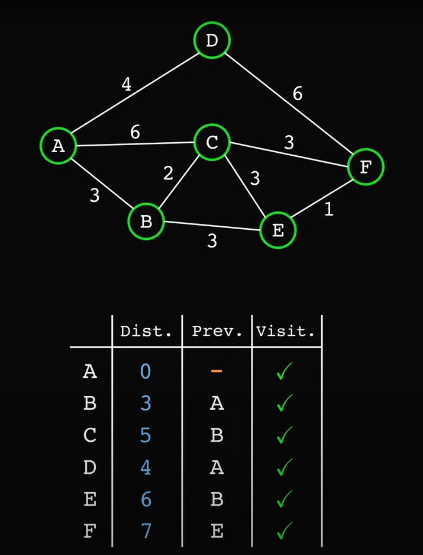
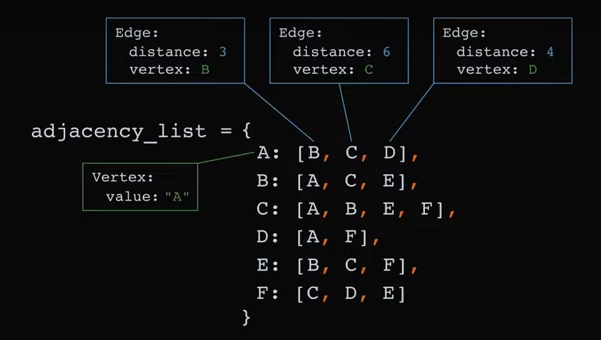
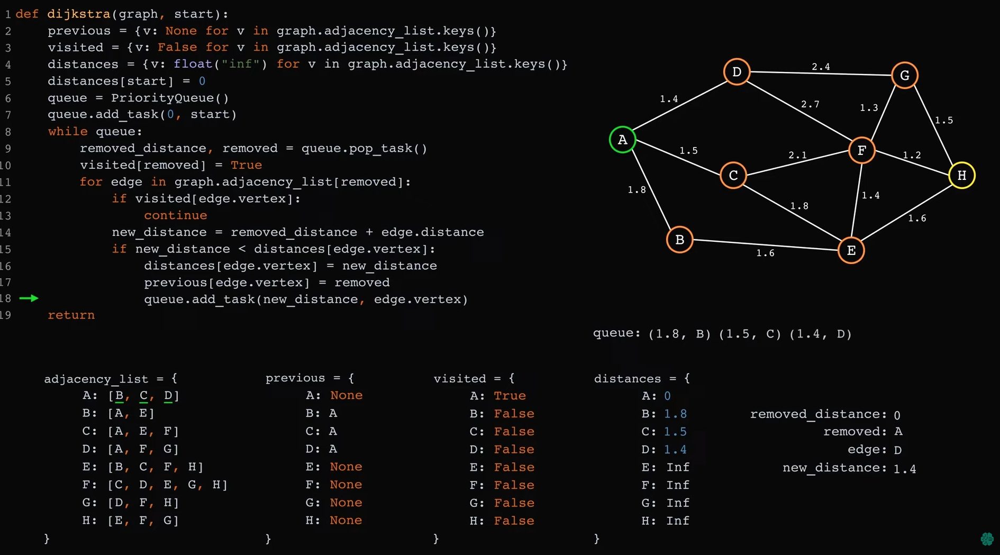
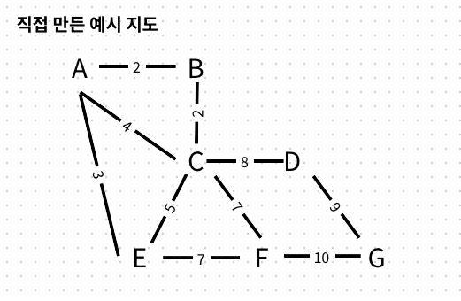

# dijkstra_algorithm

다익스트라 알고리즘 연습 및 비상 상황 시 건축물 내에서 최단 거리의 탈출 경로를 찾는 다익스트라 알고리즘 구현  
Dijkstra Algorithm practice & Developing Dijkstra algorithm that finds a shortest path to evacuate in a building when emergency

---

## 구현 목표

### I. 1차 목표

0. 다익스트라 알고리즘의 이론을 이해하고 예제를 통해 파이썬으로 구현하는 방법을 이해한다. ✅
1. 구조는 이해했으나 유튜브 예제에 나온 특정한 자료값에서만 이를 구현할 수 있는데, 일반적 상황에서도 그에 맞는 최단 경로를 찾는 코드를 작성해야함. ✅
2. 사용자가 노드를 지정했을 때 그 상황에 맞는 최단 경로를 찾는 알고리즘 구현 ✅

### II. 2차 목표

1. 사용자가 건축물의 도면을 불러오게 하는 기능 구현
2. 사용자가 건축물의 도면에서 노드를 지정할 수 있게 하는 기능 구현

- 이 과정에서의 문제는 사용자가 노드를 지정하고 각 노드들을 연결하여 최단 거리를 구하였을 때 그 경로에 벽과 같은 장애물이 가로막는 경우도 생각해야함.
- 직선 경로를 사용할 수 없는 경우에는 중간 노드를 지정하는 추가적인 단계가 필요함.

3. 사용자가 지정한 노드들을 이어 최단 경로를 탐색하고 그 최단 경로를 도면 상에 표시함.

- 하지만 현실에서의 건축물은 단층이 아닌 다층인 구조가 많으므로 가능하다면 여러 층을 이을 수 있는 기능을 구현한다.

### III. 3차 목표

1. 사용자 화면(프론트엔드)를 다듬기.

#### 우선적 목표는 2주 내로 1차 목표는 구현하고 2차 목표는 1번에서 2번까지 구현하는 것이 목표임.

---

## 2025. 7. 9.

> ex_dijkstra.py

> [참조한 유튜브 영상 링크 - [7.5] Dijkstra Shortest Path Algorithm in Python - ThinkX Academy](https://www.youtube.com/watch?v=OrJ004Wid4o)

```python
if __name__ == "__main__":
graph = {
'A' : {'B':2, 'C':4},
'B' : {'A':2, 'C':3, 'D':8},
'C' : {'A':4, 'B':3, 'D':2, 'E':5},
'D' : {'B':8, 'C':2, 'E':11, 'F':22},
'E' : {'C':5, 'D':11, 'F':1},
'F' : {'D':22, 'E':1}
}

    source = 'A'
    destination = 'F'
    dijkstra(graph, source, destination)
```

`__main__`의 의미는 직접 실행될 때만 이 코드를 실행하라는 뜻

---

## 2025. 7. 11.

> dijkstra.py

> [참조한 유튜브 영상 링크 - Dijkstra's Algorithm - A step by step analysis, with sample Python code - Glassbyte ](https://www.youtube.com/watch?v=_B5cx-WD5EA&t=44s) > [코드와 이미지 자료는 유튜브 영상을 통해 얻었습니다.]

이 영상에서는 이전 영상의 예제와는 다른 방법을 사용한다.  
먼저 distance, previous, visited의 변수를 지정한다.  


그 후 adjacency_list를 딕셔너리 자료형으로 인접한 노드에 대한 정보를 입력받는다.  


앞서 언급되었던 heapq 라이브러리를 직접 구현하여 살짝 수정한 유사한 기능을 가진 PriorityQueue를 도입해 우선순위를 결정한다.  
(사실 무슨 의미인지는 대략 알겠지만 설명하는 것이 너무 힘드니 첨부 사진을 붙이겠다.)  


이 코드는 ex_dijkstra.py 보다 좀 더 객체지향적으로 작성되었다.  
유튜브 예제의 코드를 바탕으로 몇 가지를 수정하였고, 이 코드를 바탕으로 좀 더 살을 덧붙이고자 한다.

---

먼저, 나의 매우 똑똑한 코딩친구(Name : Chatgpt-4o)의 도움을 받아 코드를 일부 수정하였다.  
사용자에게 start vertice 와 end vertice를 입력 받아 최단 경로를 만드는 기능을 구현하도록 하겠다.  
이 기능은 새로운 브랜치 'input'으로 분기하여 구현하였다.

```python
graph = Graph()
graph.add_edge(A, B, 1)
#  ...
# 이름 -> Vertex 매핑
name_to_vertex = {v.value: v for v in graph.adjacency.keys()}

# 사용자 입력
start_name = input("시작 정점의 이름을 입력하세요: ")
end_name = input("도착 정점의 이름을 입력하세요: ")
```

name_to_vertex 를 통해 graph의 key인 "Vertex(A)"를 넣는다.  
그리고 사용자의 입력을 받아 시작 정점과 도착 정점을 받는다.

```python
# 유효성 검사
if start_name not in name_to_vertex or end_name not in name_to_vertex:
    print("잘못된 정점 이름입니다.")
else:
    start = name_to_vertex[start_name]
    end = name_to_vertex[end_name]
    print(A.value)
    print(end)
    dijkstra(graph, start, end)
```

그 후 시작 정점이나 도착 정점이 name_to_vertex에 존재하는지 확인한 후 알고리즘을 실행한다.  
여기서 사용자가 어떤 vertex를 선택할 수 있는지를 알 수 없기에 Graph에서 Vertex의 이름을 얻어내는 방법을 얻기 위하여

```python
print(A.value)
print(end)
```

를 넣어 확인해보았다. 그리고 코드 가독성 향상을 위하여 value -> name 으로 일괄 수정하였다.

```python
print('선택할 수 있는 정점은 다음과 같습니다.')
for vertex in graph.adjacency.keys():
    print(vertex.name,end=" ")
print('')
```

이 코드를 직접 만들어서 추가하였다.  
결과는 다음과 같다.

> 선택할 수 있는 정점은 다음과 같습니다.  
> A B C D

---

```python
graph = Graph()
name_to_vertex = {}

while True:
    node_name = input('정점 이름을 입력하세요 (끝내려면 빈칸): ').strip() # strip(): 문자열 처리에서 불필요한 공백이나 줄바꿈을 없애는 함수.
    if node_name == "":
        break
    if node_name not in name_to_vertex:
        name_to_vertex[node_name] = Vertex(node_name)
    from_vertex = name_to_vertex[node_name]

    while True:
        adjacent_info = input(f'{node_name}에 인접한 정점과 거리 (예 : D 4), 없으면 빈칸')
        if adjacent_info == '':
            break
        try:     # try-except 구문: 에러가 날 수 있는 코드를 안전하게 실행하기 위한 예외 처리 도구: 에러가 나더라도 그냥 프로그램 속행하라
            neighbor_name, dist = adjacent_info.split() # split(): 문자열을 공백을 기준으로 나누어서 리스트로 처리하는 함수
            dist = float(dist)
        except ValueError:
            print('형식이 잘못되었습니다. 다시 입력해주세요')
            continue

        if neighbor_name not in name_to_vertex:
            name_to_vertex[neighbor_name] = Vertex(neighbor_name)
        to_vertex = name_to_vertex[neighbor_name]

        graph.add_edge(from_vertex, to_vertex, dist)
```

사용자가 정점의 이름과 인접한 정점 목록과 그 정점들과의 거리를 모두 입력하는 기능을 구현하였다.  
먼저 정점을 모두 입력하도록 한다.  
빈칸을 입력했을 때에는 if문에서 나가도록 한다.  
중복한 경우를 제외하기 위해서 not in을 활용하였고, node_name을 name_to_vertex 딕셔너리에 추가한다.  
그리고 해당 정점과 인접한 정점과 거리를 입력하도록 한다.  
마찬가지로 빈칸을 입력하면 if문이 종료된다.  
사용자가 이상한 입력값을 실행하더라도 프로그램을 속행시키기 위하여 try 구문을 활용하였다.  
사용자의 입력값을 split 함수를 이용하여 리스트에 저장하고 dist의 자료형을 float로 설정한다.  
사용자의 입력값에 대하여 ValueError가 발생하는 경우 오류가 생겼음을 출력하고 프로그램을 속행한다.
인접한 정점이 name_to_vertex 딕셔너리에 없을 때 딕셔너리에 추가한다.  
graph 객체의 기능인 add_edge를 활용하여 graph를 작성한다.

아래의 예시를 만들어서 프로그램에 대입해보았다.  
  
아래와 같이 성공적으로 결과값이 나왔다!!! 만세!!! 🎉🎉🎉🎉

```
정점 이름을 입력하세요 (끝내려면 빈칸): A
A에 인접한 정점과 거리 (예 : D 4), 없으면 빈칸B 2
~
A에 인접한 정점과 거리 (예 : D 4), 없으면 빈칸
형식이 잘못되었습니다. 다시 입력해주세요
~
정점 이름을 입력하세요 (끝내려면 빈칸): G
G에 인접한 정점과 거리 (예 : D 4), 없으면 빈칸F 10
~
선택할 수 있는 정점은 다음과 같습니다.
A B C E D F G
시작 정점의 이름을 입력하세요: A
도착 정점의 이름을 입력하세요: G
shortest distance to G:  20.0
path to G:  ['A', 'E', 'F', 'G']
```

전에 썼던 코드를 수정하지 않아 그대로 나온 부분이 있어 일부 수정하였다.

### 이로써 1차 목표를 달성하였다!!!

(상기의 내용은 새로운 브랜치 'generalized'로 분기함. 분기하고 main 브랜치로 병합.)
